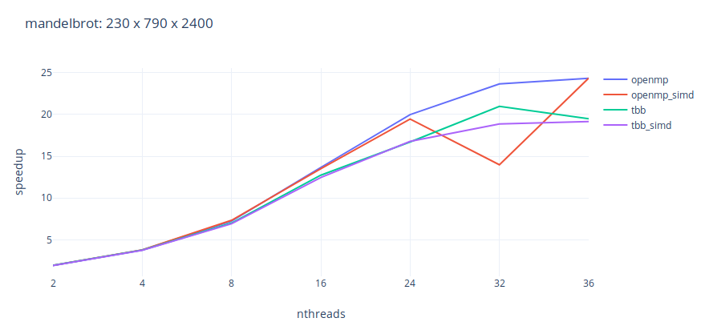
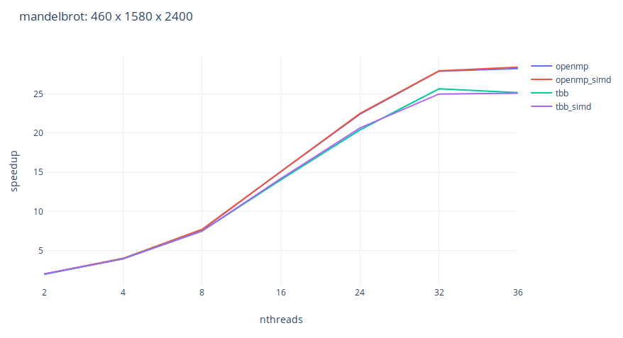
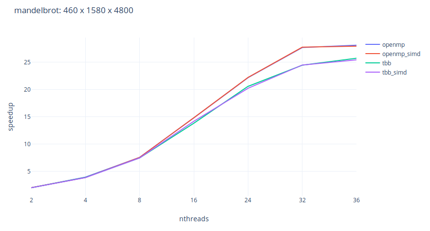
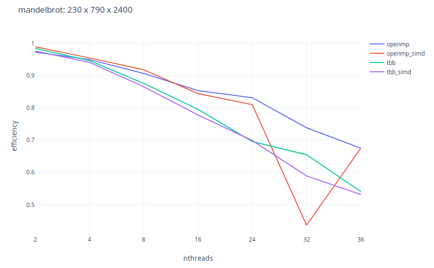
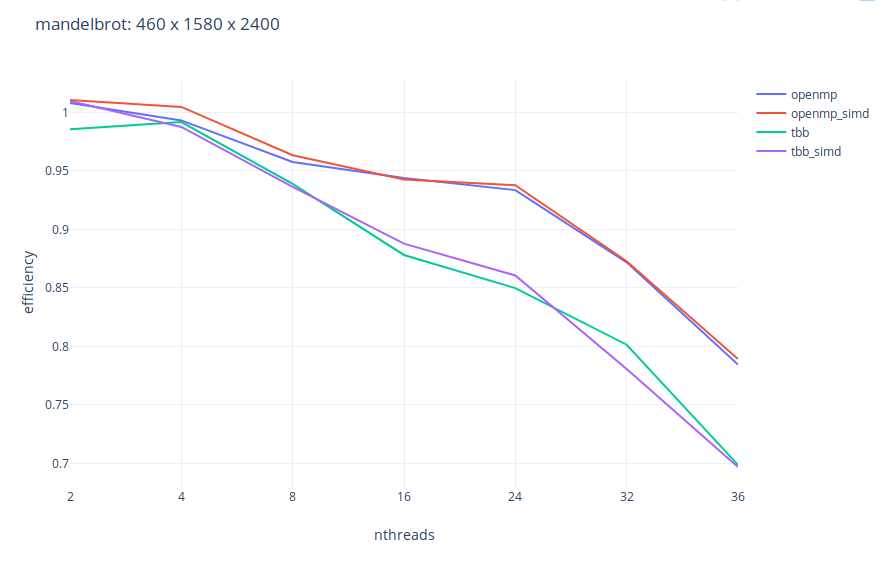
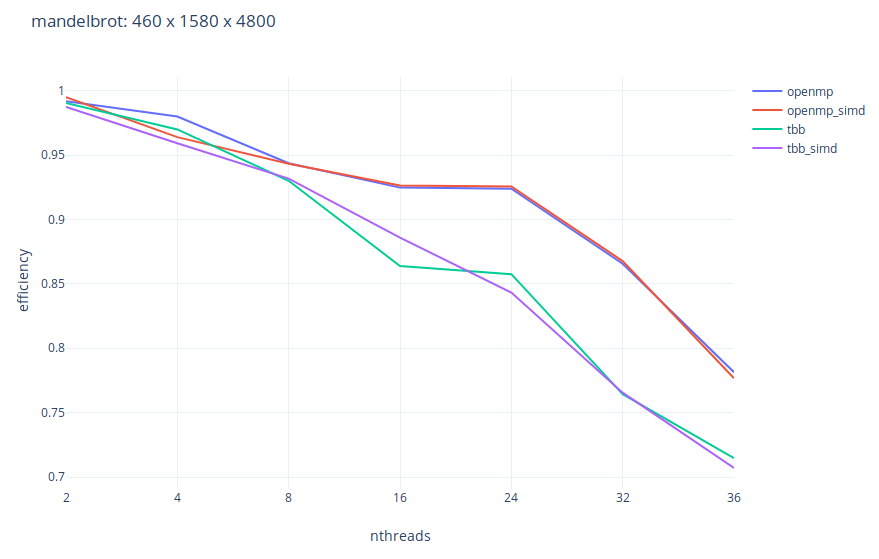

lokijuhygb

ELC139 Programação Paralela

# T10: 

Comparativo entre `OpenMP` e [TBB (Threading Building Blocks)](https://www.threadingbuildingblocks.org/) utilizando `#pragma simd` e o problema `Mandelbrot` no node [CDER03](https://help.rs.gsu.edu/display/PD/CDER).

[mandelbrot_serial.cpp](mandelbrot_serial.cpp)

[mandelbrot_openmp.cpp]

[mandelbrot_openmp_simd.cpp](mandelbrot_openmp_simd.cpp)

[mandelbrot_tbb.cpp](mandelbrot_tbb.cpp)

[mandelbrot_tbb_simd.cpp](mandelbrot_tbb_simd.cpp)

[resultados.ods](resultados.ods)

## Referências

https://en.wikipedia.org/wiki/Threading_Building_Blocks

https://software.intel.com/en-us/articles/migrate-your-application-to-use-openmp-or-intelr-tbb-instead-of-intelr-cilktm-plus

https://software.intel.com/en-us/advisor

http://www.inf.ufrgs.br/erad2018/downloads/minicursos/eradrs2018-openmp.pdf

https://www.ibm.com/support/knowledgecenter/en/SSXVZZ_16.1.1/com.ibm.xlcpp1611.lelinux.doc/compiler_ref/prag_omp_simd.html

http://hpac.rwth-aachen.de/teaching/pp-16/material/08.OpenMP-4.pdf

https://www.threadingbuildingblocks.org/docs/help/reference/appendices/community_preview_features/tbb_global_control.htm
