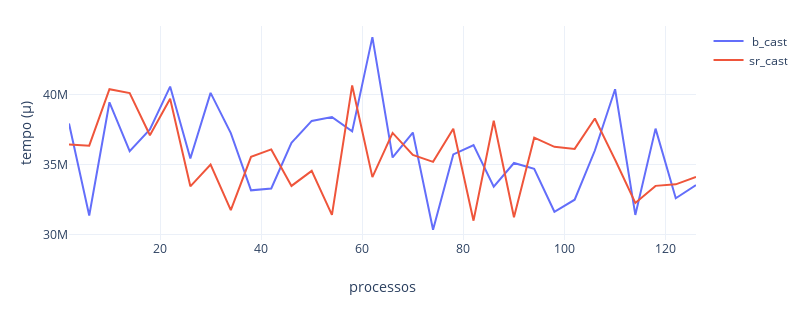
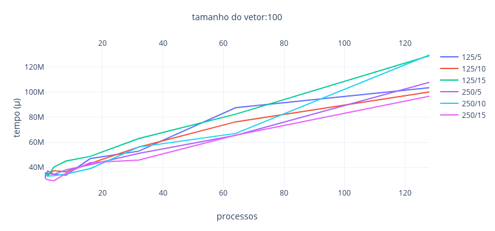
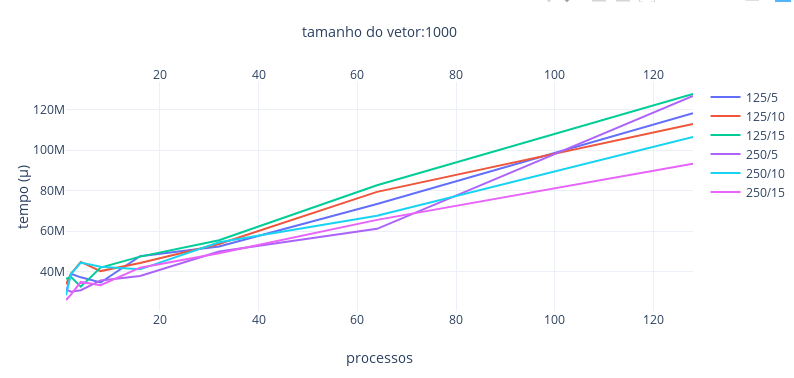
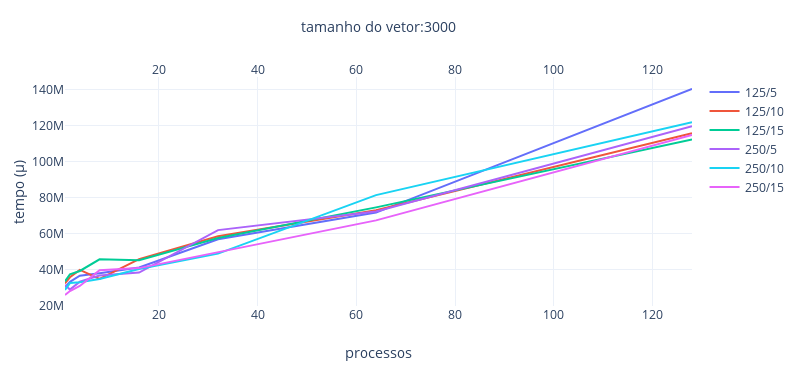

lokijuhygb

ELC139 Programação Paralela

# T7: Avaliação de desempenho de programas MPI

## Parte 1:

[specs.txt](specs.txt)

[testes_mpi.sh](testes_mpi.sh)

[b_bcast.c](b_bcast.c)

[resultados_parte1.csv](resultados_parte1.csv)

## Parte 2:

[resultados_parte2.csv](resultados_parte2.csv)

## Referências

- [MPI: A Message-Passing Interface Standard](https://www.mpi-forum.org/docs/mpi-3.1/mpi31-report.pdf)  
- [A Comprehensive MPI Tutorial Resource](http://mpitutorial.com/)  
- [Tutorial MPI](https://computing.llnl.gov/tutorials/mpi/)  
- [SMPI CourseWare](https://simgrid.github.io/SMPI_CourseWare/)
- [SMPI - Describing the virtual platform](http://simgrid.gforge.inria.fr/simgrid/3.20/doc/platform.html)
